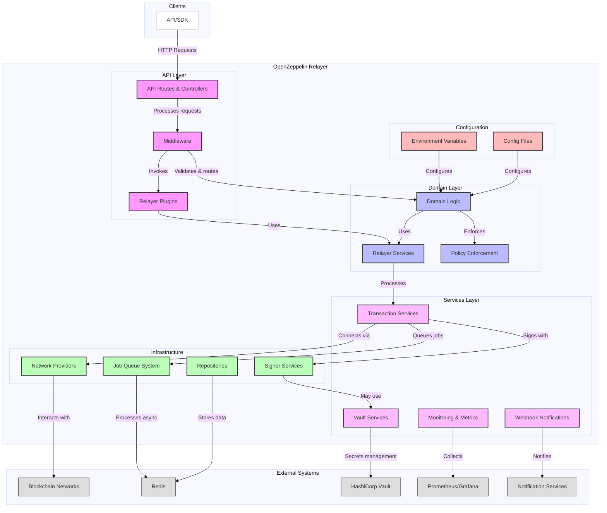

# OpenZeppelin Relayer

[](https://codecov.io/gh/OpenZeppelin/openzeppelin-relayer)
[](https://api.securityscorecards.dev/projects/github.com/OpenZeppelin/openzeppelin-relayer)
[](https://www.gnu.org/licenses/agpl-3.0)
[](https://github.com/OpenZeppelin/openzeppelin-relayer/actions/workflows/cla.yml)
[](https://github.com/OpenZeppelin/openzeppelin-relayer/actions/workflows/ci.yaml)
[](https://github.com/OpenZeppelin/openzeppelin-relayer/actions/workflows/release-please.yml)


This relayer service enables interaction with blockchain networks through transaction submissions. It offers multi-chain support and an extensible architecture for adding new chains.

[User Docs](https://docs.openzeppelin.com/relayer/) | [Quickstart](https://docs.openzeppelin.com/relayer/quickstart)

## Features

- **Multi-Chain Support**: Interact with multiple blockchain networks, including Solana and EVM-based chains.
- **Transaction Relaying**: Submit transactions to supported blockchain networks efficiently.
- **Transaction Signing**: Securely sign transactions using configurable key management.
- **Transaction Fee Estimation**: Estimate transaction fees for better cost management.
- **Solana Gasless Transactions**: Support for gasless transactions on Solana, enabling users to interact without transaction fees.
- **Transaction Nonce Management**: Handle nonce management to ensure transaction order.
- **Transaction Status Monitoring**: Track the status of submitted transactions.
- **SDK Integration**: Easily interact with the relayer through our companion JavaScript/TypeScript SDK.
- **Extensible Architecture**: Easily add support for new blockchain networks.
- **Configurable Network Policies**: Define and enforce network-specific policies for transaction processing.
- **Metrics and Observability**: Monitor application performance using Prometheus and Grafana.
- **Docker Support**: Deploy the relayer using Docker for both development and production environments.
- **Relayer Plugins**: Extend the relayer functionality through TypeScript functions.

## Supported networks

- Solana
- EVM
- Stellar

> For details about current development status and upcoming features, check our [Project Roadmap](https://docs.openzeppelin.com/relayer/roadmap).

## For users

### Installation

View the [Installation](https://docs.openzeppelin.com/relayer#getting_started) documentation for detailed information. For a quicker introduction, check out the [Quickstart](https://docs.openzeppelin.com/relayer/quickstart) guide.

### Usage

View the [Usage](https://docs.openzeppelin.com/relayer#running_the_relayer) documentation for more information.

### Examples

The repository includes several ready-to-use examples to help you get started with different configurations:

| Example                                                      | Description                               |
| ------------------------------------------------------------ | ----------------------------------------- |
| [`basic-example`](./examples/basic-example/)                 | Simple setup with Redis                   |
| [`redis-storage`](./examples/redis-storage/)                 | Simple setup with Redis for storage       |
| [`basic-example-logging`](./examples/basic-example-logging/) | Configuration with file-based logging     |
| [`basic-example-metrics`](./examples/basic-example-metrics/) | Setup with Prometheus and Grafana metrics |
| [`vault-secret-signer`](./examples/vault-secret-signer/) | Using HashiCorp Vault for key management      |
| [`vault-transit-signer`](./examples/vault-transit-signer/) | Using Vault Transit for secure signing      |
| [`evm-turnkey-signer`](./examples/evm-turnkey-signer/) | Using Turnkey Signer for EVM secure signing     |
| [`solana-turnkey-signer`](./examples/solana-turnkey-signer/) | Using Turnkey Signer for Solana secure signing |
| [`solana-google-cloud-kms-signer`](./examples/solana-google-cloud-kms-signer/) | Using Google Cloud KMS Signer for Solana secure signing |
| [`network-configuration-config-file`](./examples/network-configuration-config-file/) | Using Custom network configuration via config file |
| [`network-configuration-json-file`](./examples/network-configuration-json-file/) | Using Custom network configuration via json file |


Each example includes:

- A README with step-by-step instructions
- Docker Compose configuration
- Required configuration files

## For Developers

### Technical Overview

The OpenZeppelin Relayer is built using Actix-web and provides HTTP endpoints for transaction submission, in-memory repository implementations, and configurable network policies.

The following diagram illustrates the architecture of the relayer service, highlighting key components and their interactions.



### Project Structure

The project follows a standard Rust project layout:

```sh
openzeppelin-relayer/
├── src/
│   ├── api/              # Route and controllers logic
│   ├── bootstrap/        # Service initialization logic
│   ├── config/           # Configuration logic
│   ├── constants/        # Constant values used in the system
│   ├── domain/           # Domain logic
│   ├── jobs/             # Asynchronous processing logic (queueing)
│   ├── logging/          # Logs File rotation logic
│   ├── metrics/          # Metrics logic
│   ├── models/           # Data structures and types
│   ├── repositories/     # Configuration storage
│   ├── services/         # Services logic
│   ├── plugins/          # Relayer plugins
│   └── utils/            # Helper functions
│
├── config/               # Configuration files
├── tests/                # Integration tests
├── docs/                 # Documentation
├── scripts/              # Utility scripts
├── examples/             # Configuration examples
├── helpers/              # Rust helper scripts
└── ... other root files (Cargo.toml, README.md, etc.)
```

### Prerequisites

- Docker
- Rust
- Redis
- [Sodium](https://doc.libsodium.org/)
- [Node.js + Typescript + ts-node](https://nodejs.org/) (v20+) for plugins.

### Setup

To get started, clone the repository:

```sh
git clone https://github.com/openzeppelin/openzeppelin-relayer
cd openzeppelin-relayer
```

Run the following commands to install pre-commit hooks:

- Install pre-commit hooks:

  ```bash
  pip install pre-commit
  pre-commit install --install-hooks -t commit-msg -t pre-commit -t pre-push
  ```

  > :warning: If you encounter issues with pip, consider using [pipx](https://pipx.pypa.io/stable/installation/) for a global installation.

- Install the toolchain:

  ```sh
  rustup component add rustfmt
  ```

### Install Sodium

- Install stable libsodium version from [here](https://download.libsodium.org/libsodium/releases/).
- Follow steps to install libsodium from the [libsodium installation guide](https://doc.libsodium.org/installation).

### Install Node.js

- Install Node.js from [here](https://nodejs.org/).
- Install Typescript and ts-node:

  ```bash
  npm install -g typescript ts-node
  ```

### Run Tests

To run tests, use the following commands:

```bash
cargo test
cargo test properties
cargo test integration
```

### Config files

Create `config/config.json` file. You can use `config/config.example.json` as a starting point:

```sh
cp config/config.example.json config/config.json
```

Refer to the [Configuration References](https://docs.openzeppelin.com/relayer#configuration_references) section for a complete list of configuration options.

Create `.env` with correct values according to your needs from `.env.example` file as a starting point:

```sh
cp .env.example .env
```

> **Note**: After the service is running, all configuration components (relayers, signers, notifications) can also be managed via REST API endpoints for runtime changes. See the [Configuration Guide](https://docs.openzeppelin.com/relayer/configuration) for details on API-based configuration management.

### Creating a Signer

To create a new signer keystore, use the provided key generation tool:

```sh
cargo run --example create_key -- \
    --password DEFINE_YOUR_PASSWORD \
    --output-dir config/keys \
    --filename local-signer.json
```

Then update the `KEYSTORE_PASSPHRASE` field in your `.env` file with the password you used in the key creation example.

The tool supports the following options:

- `--password`: Required. Must contain at least:
  - 12 characters
  - One uppercase letter
  - One lowercase letter
  - One number
  - One special character
- `--output-dir`: Directory for the keystore file (creates if not exists)
- `--filename`: Optional. Uses timestamp-based name if not provided
- `--force`: Optional. Allows overwriting existing files

Example with all options:

```sh
cargo run --example create_key -- \
    --password "YourSecurePassword123!" \
    --output-dir config/keys \
    --filename local-signer.json \
    --force
```

### Configure Webhook URL

`/config/config.json` file is partially pre-configured. You need to specify the webhook URL that will receive updates from the relayer service.

For simplicity, visit [Webhook.site](https://webhook.site), copy your unique URL, and then update the notifications[0].url field in `config/config.json` with this value.

### Configure Webhook Signing Key

To sign webhook notification payloads, populate the `WEBHOOK_SIGNING_KEY` entry in the `.env` file.

For development purposes, you can generate the signing key using:

```bash
cargo run --example generate_uuid
```

> Note: Alternatively, you can use any online UUID generator.

Copy the generated UUID and update the `WEBHOOK_SIGNING_KEY` entry in the `.env` file.

### Configure API Key

Generate an API key signing key for development purposes using:

```bash
cargo run --example generate_uuid
# or run this command to generate a UUID
# uuidgen
```

> Note: Alternatively, you can use any online UUID generator.

Copy the generated UUID and update the `API_KEY` entry in the `.env` file.

### Starting Redis manually (without docker compose)

You can start Redis in one of two ways:

A. _Expose to Host Only_

Use this if only your host machine needs direct access to Redis (e.g., for local testing with redis-cli).

```bash
docker run -d \
  --name redis \
  -p 6379:6379 \
  redis:latest
```

`-p 6379:6379` binds the container port to your localhost on the same port.

B. _Connect with Other Containers via Custom Network_

Use this if relayer container need to talk to Redis.

```sh
docker run -d \
  --name redis \
  --network relayer-net \
  redis:latest
```

`--network relayer-net` attaches Redis to the network you created in step 1.

> Note: Make sure to create a dedicated network for the relayer and Redis containers to communicate. You can create a network using the following command `docker network create relayer-net`.

## Configure a plugin

In order to create and run plugins please follow the [Plugins README](./plugins/README.md) file instructions.

## Running the relayer locally

Install dependencies:

```sh
cargo build
```

Run relayer:

```sh
cargo run
```

## Test the Relayer

The service is available at `http://localhost:8080/api/v1`

```bash
curl -X GET http://localhost:8080/api/v1/relayers \
  -H "Content-Type: application/json" \
  -H "AUTHORIZATION: Bearer YOUR_API_KEY"
```

### Running services with docker compose

If you use `docker-compose` over `docker compose` please read [Compose V1 vs Compose V2](#compose-v1-vs-compose-v2) section.

Based on your `.env` file, docker compose may or may not start the metrics server ( within relayer app container), prometheus and grafana.

> Note: If you want to start the metrics server, prometheus and grafana, make sure to set `METRICS_ENABLED=true` in your `.env` file.

If you want to start the services using [make](./Makefile.toml) target, you can use the following command to start the services:

```sh
cargo make docker-compose-up
```

> Note: By default docker compose command uses Dockerfile.development to build the image. If you want to use Dockerfile.production, you can set: `DOCKERFILE=Dockerfile.production` before running `cargo make docker-compose-up`.

We have a [make](./Makefile.toml) target to start the services with docker compose with metrics profile based on your `.env` file. For metrics server you will need to make sure `METRICS_ENABLED=true` is set in your `.env` file. If you want to start the services directly using docker compose, you can use the following command:

```sh
# without metrics profile ( METRICS_ENABLED=false by default )
# will only start the relayer app container and redis container
docker compose up -d
# or with metrics profile ( METRICS_ENABLED=true in .env file )
# docker compose --profile metrics up -d
```

Make sure the containers are running without any restarts/issues:

```sh
docker ps -a
```

To stop the services, run the following command:

```sh
cargo make docker-compose-down
# or
# using docker compose without make target
# without metrics profile
# docker compose down
# or with metrics profile
# docker compose --profile metrics down
```

To check the logs of the services/containers, run the following command:

```sh
docker compose logs -f
```

## Compose V1 vs Compose V2

- If you use `docker-compose` command, it will use Compose V1 by default which is deprecated. We recommend using `docker compose` command.
- You can read more about the differences between Compose V1 and Compose V2 [here](https://docs.docker.com/compose/intro/history/).
- You can also check out the issue [here](https://github.com/OpenZeppelin/openzeppelin-relayer/issues/64).

## Documentation

- Pre-requisites:

  - You need `antora` `site-generator` and `mermaid` extension to generate the documentation.

  - You can directly install these dependencies by running `cd docs && npm i --include dev`. If you want to install them manually, you can follow the steps mentioned below.
  - Install `antora` locally, you can follow the steps mentioned [here](https://docs.antora.org/antora/latest/install/install-antora/#install-dir), if you already have you can skip this step.
    > Note: If you want to install globally, you can run:
    >
    > `npm install -g @antora/cli@3.1 @antora/site-generator@3.1 @sntke/antora-mermaid-extension`
  - Verify the installation by running `antora --version` or by running `npx antora --version` if you installed it locally.

- To generate documentation locally, run the following command:

  ```sh
  cargo make rust-antora
  ```

- Site will be generated in `docs/build/site/openzeppelin_relayer/<version>/` directory.

- To view the documentation, open the `docs/build/site/openzeppelin_relayer/<version>/index.html` in your browser.

## Observability

- Currently we support logs and metrics ( uses prometheus and grafana) for the relayer server.

### Logs

- For logs, our app defaults to writing logs to stdout/console. You can also configure it to write logs to a file path by setting `LOG_MODE` to `file`. See [docker compose file](./docker-compose.yaml) for more details.

### Metrics

- Metrics server is started on port `8081` by default, which collects the metrics from the relayer server.

  - Exposes list of metrics on the `/metrics` endpoint.

    > Note: By default, we don't map this port to the host machine. If you want to access the metrics server from the host machine, you can update the `docker-compose.yaml` file.

  - Exposes `/debug/metrics/scrape` endpoint for prometheus to scrape metrics.

- To view prometheus metrics in a UI, you can use `http://localhost:9090` on your browser.

- To view grafana dashboard, you can use `http://localhost:3000` on your browser.

## Contributing

We welcome contributions from the community! Here's how you can get involved:

1. Fork the repository
2. Create your feature branch
3. Commit your changes
4. Push to the branch
5. Create a Pull Request

If you are looking for a good place to start, find a good first issue [here](https://github.com/openzeppelin/openzeppelin-relayer/issues?q=is%3Aissue%20is%3Aopen%20label%3Agood-first-issue).

You can open an issue for a [bug report](https://github.com/openzeppelin/openzeppelin-relayer/issues/new?assignees=&labels=T-bug%2CS-needs-triage&projects=&template=bug.yml), [feature request](https://github.com/openzeppelin/openzeppelin-relayer/issues/new?assignees=&labels=T-feature%2CS-needs-triage&projects=&template=feature.yml), or [documentation request](https://github.com/openzeppelin/openzeppelin-relayer/issues/new?assignees=&labels=T-documentation%2CS-needs-triage&projects=&template=docs.yml).

You can find more details in our [Contributing](CONTRIBUTING.md) guide.

Please read our [Code of Conduct](CODE_OF_CONDUCT.md) and check the [Security Policy](SECURITY.md) for reporting vulnerabilities.

## License

This project is licensed under the GNU Affero General Public License v3.0 - see the [LICENSE](LICENSE) file for details.

## Security

For security concerns, please refer to our [Security Policy](SECURITY.md).

## Get Help

If you have any questions, first see if the answer to your question can be found in the [User Documentation](https://docs.openzeppelin.com/relayer/).

If the answer is not there:

- Join the [Telegram](https://t.me/openzeppelin_tg/2) to get help, or
- Open an issue with [the bug](https://github.com/openzeppelin/openzeppelin-relayer/issues/new?assignees=&labels=T-bug%2CS-needs-triage&projects=&template=bug.yml)

We encourage you to reach out with any questions or feedback.

## Maintainers

See [CODEOWNERS](CODEOWNERS) file for the list of project maintainers.
